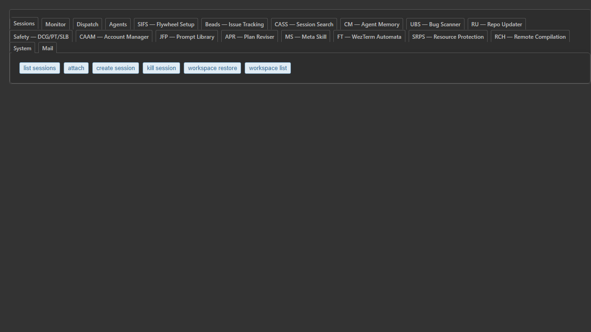

# Tabby Quick Cmd Buttons

## Please install quick-cmds plugin first

## For the Tabby terminal

This plugin create buttons for quick commands, based on Eugene Pankov's tabby-clippy
Codes:

* <https://github.com/weijia/tabby-quick-cmds-buttons/>

* <https://gitee.com/weijia/tabby-quick-cmds-buttons>

## Build

yarn build

## Publish

npm publish

