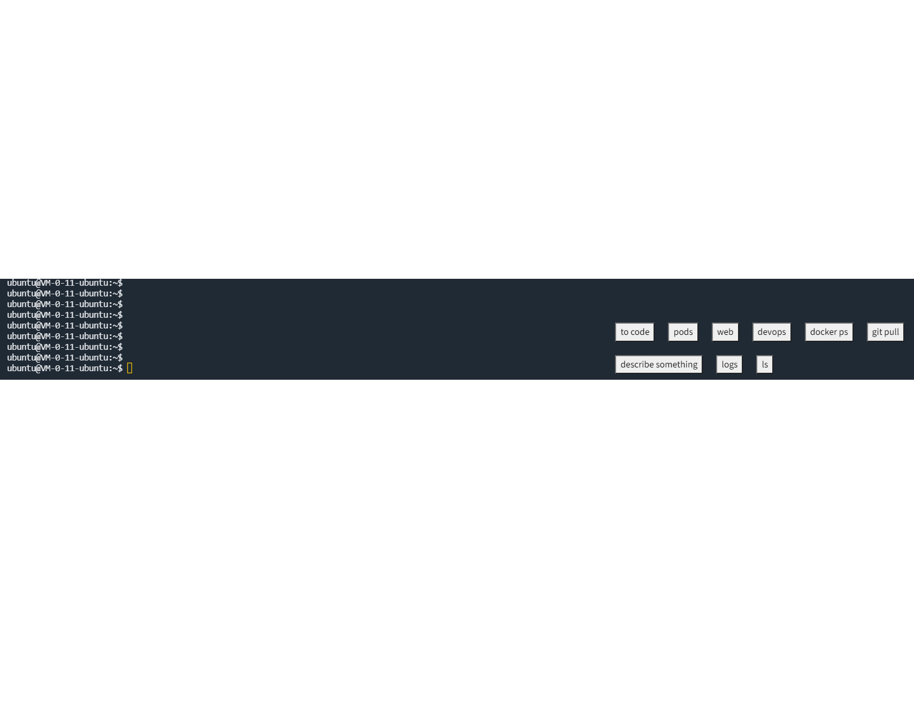

# Tabby Quick Cmd Buttons
# Please install quick-cmds plugin first

#### For the Tabby terminal

This plugin create buttons for quick commands, based on Eugene Pankov's tabby-clippy
Codes:
* https://github.com/weijia/tabby-quick-cmds-buttons/
* https://gitee.com/weijia432/tabby-quick-cmds-buttons

#### I'm hunting a remote job opportunity
#### 我正在找一个可以远程上班的工作
